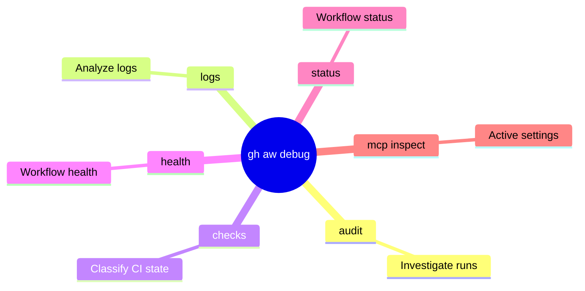

# gh-aw-troubleshooting

<!-- markdownlint-disable MD013 MD023 MD031 MD032 -->

Diagnose, troubleshoot, and fix failing GitHub Agentic Workflows by analyzing logs, verifying MCP configurations, and correcting frontmatter.

## When to Use

- When a GitHub Agentic Workflow run fails and requires root-cause analysis.
- To diagnose `401 Unauthorized`, missing tools, or firewall egress blocks in an agent session.
- When an agent's `safe-outputs` configuration is rejecting intended file writes or API calls.

## When Not to Use

- For debugging standard CI/CD pipelines (like unit tests or linters) that do not involve `gh-aw` agents (use `github-actions` instead).
- When editing the conversational prompt text inside the markdown file without changing the YAML frontmatter constraints (this rarely causes structural failures).
- For troubleshooting standard GitHub CLI authentication issues unrelated to Agentic Workflows.

## Common Pitfalls

- **Ignoring the Firewall**: Assuming a network call failed due to code errors, rather than checking the `network.allowed` list in the frontmatter which strictly blocks unapproved domains.
- **Missing Recompilation**: Editing the `.md` workflow file but forgetting to run `gh aw compile`, meaning the actual executed GitHub Actions `.lock.yml` remains unchanged and still fails.
- **Over-Permissive Fixes**: "Fixing" a permissions error by granting `write-all` to the GitHub token instead of carefully mapping the exact minimum required scope in `safe-outputs`.

## Core Process

1. **Extract Run ID**: Parse the workflow run URL (e.g., `https://github.com/*/actions/runs/<run-id>`) to identify the `{run-id}`.
2. **Audit the Run**: Execute `gh aw audit <run-id> --json` to download artifacts and generate a diagnostic report.
3. **Analyze Missing Tools**:
   - Check the `missing_tools` array in the audit output.
   - Review `safe_outputs.jsonl` for attempted tool calls.
   - Compare against the workflow's `tools:` and `safe-outputs:` configuration.
4. **Review Agent Logs**: Inspect `logs/run-<run-id>/agent-stdio.log` for the agent's reasoning and specific error messages.
5. **Identify Root Cause**: Determine if the failure is due to missing `tools`, incorrect `permissions`, `mcp-scripts` mismatches, or `safe-outputs` configuration errors.
6. **Verify Configuration**: Run `gh aw mcp inspect <workflow-name>` to check active MCP server settings and toolsets.
7. **Apply Fix**: Update the workflow's YAML frontmatter or prompt instructions.
8. **Recompile & Test**: Run `gh aw compile <workflow-name>` and trigger a run with `gh aw run <workflow-name>` to verify the fix.

## Key Commands

- `gh aw audit <run-id> [--json]` → investigate a specific run or diff multiple runs
- `gh aw logs [workflow-name] --json` → download and analyze workflow logs
- `gh aw checks` → classify CI check state
- `gh aw compile [--strict]` → validate workflow syntax
- `gh aw run <workflow-name>` → run a workflow (requires workflow_dispatch)
- `gh aw status` → show status of agentic workflows in the repository
- `gh aw health` → show health overview of all workflows in the repository
- `gh aw mcp inspect <workflow-name>` → check active MCP server settings

### Mindmap of Debug Commands



## Manual Debugging with CLI Commands

### Audit a specific run

- `gh aw audit RUN_ID` → human-readable summary
- `gh aw audit RUN_ID --json` → machine-readable diagnostic output
- `gh aw audit RUN_ID --parse` → writes detailed `log.md` and `firewall.md` reports

The audit report covers: **failure summary**, **tool usage**, **MCP server health**, **firewall analysis**, **token metrics**, and **missing tools**.

### Analyze logs across multiple runs

- `gh aw logs my-workflow` → basic log analysis
- `gh aw logs my-workflow --format markdown --count 10` → markdown report of last 10 runs
- `gh aw logs --filtered-integrity` → analysis restricted to runs with DIFC-filtered events

### Compare two runs for regressions

- `gh aw audit BASELINE_ID CURRENT_ID` → multi-dimensional diff of metrics, tooling, and behavior

## Iterative Debug Workflow

1. **Observe**: Check the workflow run summary in the GitHub Actions UI for immediate failure signals.
2. **Audit**: Run `gh aw audit RUN_ID` for a structured breakdown of the root cause.
3. **Consult Agent**: For complex issues, use `/agent agentic-workflows` in Copilot Chat to analyze artifacts.
4. **Fix**: Edit the `.md` workflow file based on findings.
5. **Validate**: Run `gh aw compile` to ensure frontmatter schema and syntax are correct.
6. **Execute**: Trigger a new run (e.g., `gh aw run <workflow-name>`).
7. **Verify**: Compare the new run against the baseline with `gh aw audit BASELINE_ID NEW_ID`.

## Common Failure Patterns & Fixes

### Authentication & Authorization

- **Error**: `401 Unauthorized` or `Authentication failed`.
- **Cause**: Missing or expired `COPILOT_TOKEN` or `OPENAI_API_KEY`.
- **Fix**: Rotate secrets or check organization policy for Copilot access.

### Missing Tools & MCP Connectivity

- **Error**: `Tool '...' not found` or `initialize: timeout`.
- **Cause**: Tool missing from `tools:` section, server timeout, or schema mismatch.
- **Fix**: Add the missing MCP server to `tools:`, verify config with `gh aw mcp inspect`, increase `startup-timeout`, or recompile to sync with latest MCP gateway schema.

Example fix for missing `github` tools:
```aw
tools:
  github:
    toolsets: [default]
```

### Network & Firewall Restrictions

- **Error**: `blocked egress to domain:443`.
- **Cause**: Domain not included in `network.allowed` list in frontmatter.
- **Fix**: Add the blocked domain to the allowlist (refer to `firewall.md` from `--parse`).

### Safe-Outputs & Permissions

- **Error**: `Write operations fail` or `safeoutputs noop` permission denied.
- **Cause**: Missing `permissions:`, or attempting to use bash for operations that require `safe-outputs`.
- **Fix**: Ensure `safe-outputs:` is correctly configured and permissions (e.g., `issues: read`) are granted. Prefer `read` permissions combined with `safe-outputs` for mutations.

Example `safe-outputs` configuration:
```aw
permissions:
  issues: read

safe-outputs:
  jobs:
    create-issue:
      labels: ["bug"]
```

### MCP Scripts & Payload Mapping

- **Error**: "missing tool configuration for mcpscripts-gh" or resource creation failures.
- **Cause**: `mcp-scripts` does not correctly map event payload fields.
- **Fix**: Correct the mapping in the frontmatter.

Example mapping:
```aw
mcp-scripts:
  issue:
    number: ${{ github.event.issue.number }}
    title: ${{ github.event.issue.title }}
```

### Compilation & Schema

- **Error**: Fields silently ignored or `Schema validation failed`.
- **Cause**: Misspelled fields (silently discarded!) or outdated `.lock.yml`.
- **Fix**: Use `gh aw compile --verbose` to find schema errors and regenerate the lock file.

## Debug Flows

### Workflow Run URL Analysis

1. **Audit**: `gh aw audit <run-id> --json`.
2. **Analyze Missing Tools**:
   - Check `missing_tools` array in audit output.
   - Review `safe_outputs.jsonl` artifact.
   - **Common scenarios**: Incorrect tool name (e.g., calling `safeoutputs-create_issue` instead of `create_issue`), tool not in `tools:` section, safe-output not enabled, name mismatch (underscores vs hyphens).
3. **Review Agent Logs**: Check `logs/run-<run-id>/agent-stdio.log` for reasoning and errors.

### Analyze Existing Logs

1. **Download Logs**: `gh aw logs <workflow-name> --json`.
2. **Token Usage Data**:
   - Per-request detail: `firewall-audit-logs` artifact (`api-proxy-logs/token-usage.jsonl`).
   - Aggregated summary: `agent` artifact (`agent_usage.json`).
3. **Analyze**: Identify errors, patterns, token usage, and execution time.

### Run and Audit

1. **Verify Trigger**: Ensure `workflow_dispatch` is present in `on:`.
2. **Run**: `gh aw run <workflow-name>`.
3. **Poll Audit Results**: Use `gh aw audit <run-id> --json` in a loop until terminal status (`completed`, `failure`, `cancelled`).

## Investigation Steps

1. **Verify Version**: Run `gh extension list | grep 'github/gh-aw'` to retrieve the installed `gh aw` version, then ensure it is not in the retired range `[0.68.4, 0.71.3]`. If it is, run `gh extension upgrade aw`.
2. **Check Logs**: Look for `Error: Tool '...' not found` or `Error: 403`. Use `gh aw audit <run-id> --json` for detailed insights.
3. **Inspect MCP**: Ensure `gh aw mcp inspect` shows the expected toolsets.
4. **Validate Triggers**: Ensure `mcp-scripts` maps the correct event payload fields.
5. **Check Recompilation**: Verify the `.lock.yml` timestamp matches your last edit.

## Core Principles & Safety

- **Frontmatter Focused**: Most failures originate in the YAML frontmatter. Always check `permissions:`, `tools:`, `mcp-scripts:`, and `safe-outputs:`.
- **Compile Mandatory**: Any change to `.md` workflow files MUST be recompiled using `gh aw compile`.
- **Least Privilege**: Only add the specific permissions required for the failing operation.
- **Inside Workflows**: To run `gh aw logs` within a workflow, add `actions: read` permission and install the extension via `setup-cli`.

## References

- [Upstream Debug Prompt](https://raw.githubusercontent.com/github/gh-aw/v0.74.3/.github/aw/debug-agentic-workflow.md)
- [gh-aw Runbook](https://github.com/github/gh-aw/blob/v0.74.3/.github/aw/runbooks/workflow-health.md)
- [Official gh-aw Repo](https://github.com/github/gh-aw)
- [Debugging Agentic Workflows](https://github.com/github/gh-aw/blob/v0.74.3/debug.md)
- [Maintaining Repositories with Agentic Workflows](https://github.com/github/gh-aw/blob/v0.74.3/docs/src/content/docs/practices/maintaining-repos.md)

## Related Skills

- **gh-aw**: Core CLI commands for repository automation.
- **github-aw**: Guidance on incremental workflow updates and prompt engineering.
