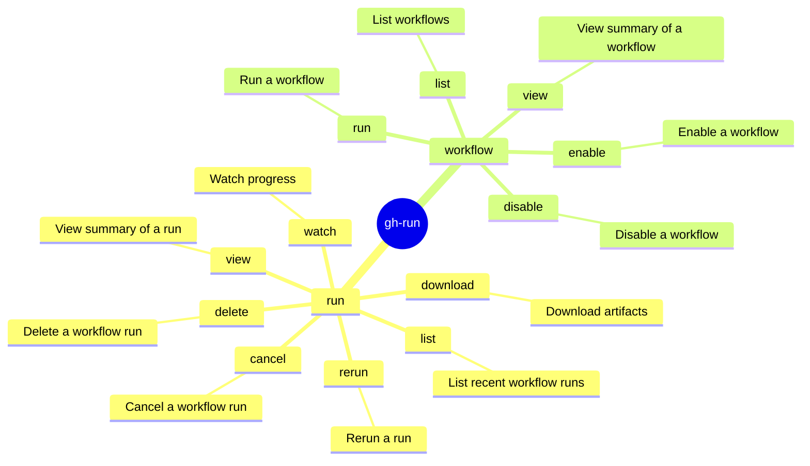

# gh-run Skill

Use `gh run` and `gh workflow` to interact with GitHub Actions workflows. Prefer structured output and explicit
routing over brittle shell post-processing.

## When to Use

- When diagnosing why a specific GitHub Actions CI/CD pipeline failed.
- To download artifact logs for a run that is currently stuck or in progress.
- When manually triggering a `workflow_dispatch` event via the CLI.

## When Not to Use

- For retrieving standard Pull Request metadata (use `gh pr view` instead).
- When attempting to write or modify the actual `.github/workflows/*.yml` files (this skill is for *execution and monitoring*, not authoring).
- To read agent-specific artifacts (like `token-usage.jsonl`) when the `gh aw audit` command provides a better native parser.

## Common Pitfalls

- **Assuming Empty Logs Mean Success**: Using `gh run view --log` and getting nothing back, assuming the job passed, when it actually means the log stream failed or the job was cancelled.
- **Missing Triggered Runs**: Running `gh pr checks` and assuming it shows all related runs, completely missing manually triggered runs or `issue_comment` triggers that aren't bound to the HEAD commit.
- **Ignoring Job Context**: Looking at the overarching run status instead of drilling down into the specific `job_id` that actually failed, wasting time searching healthy logs.

## Mindmap of Commands



## Workflow Run Diagnostics

- **Checking Latest Runs for a Pull Request**:
  - Use the native tool mapping directly to the PR's HEAD commit to elegantly
    output standard CI/CD checks (successes, failures, skips) and obtain direct
    URLs to workflow jobs:

    ```bash
    gh pr checks <number> --repo <owner>/<repo>
    ```

  - **Limitation**: `gh pr checks` is fast but only evaluates the *latest* runs on the HEAD commit.
    It completely misses manually triggered (`workflow_dispatch`) or comment-triggered (`issue_comment`) agent runs.
  - **Workaround**: To find **all** workflow runs robustly associated with a PR
    (including custom actions and agent triggers), you must match the PR's
    `headRefName` OR `title` via the API. Refer to the `gh-api` skill for
    exactly how to query the `/actions/runs` endpoint robustly for this purpose.

- **Fetching Logs for In-Progress Runs or Multiple Attempts**:
  - `gh run view --log` only fetches logs for the *latest completed* attempt and often fails on in-progress runs
    or expired attempts.
  - The API endpoint `/repos/<owner>/<repo>/actions/jobs/<job_id>/logs` often fails during
    redirect (403 AuthenticationFailed) if called dynamically with `gh api` or curl.
  - **Robust Solution**: Use the ZIP log endpoint which encapsulates all job logs for a specific full run attempt,
    even if the run is still in progress:

    ```bash
    gh api /repos/<owner>/<repo>/actions/runs/<run_id>/attempts/<attempt_num>/logs > /tmp/logs.zip
    unzip /tmp/logs.zip -d /tmp/logs
    ```

    *(Note: This requires `unzip` and shell redirection to be available in the environment.)*
    This produces a structure where logs are either:
    1. In a directory matching the *Job Name* (e.g. `Job Name/1_Set up job.txt`).
    2. A single raw `.txt` file at the root level prefixed with a number but suffixed with the job name
       (e.g. `0_copilot.txt`) for monolithic/agent runs.
    Check both locations and concatenate the `.txt` files to reliably provide the full job execution logs
    regardless of progress state.

- `gh run view <run_id> --log-failed` is only reliable when the relevant job
  or run concluded with failure.
- Prefer structured inspection with
  `gh run view <run_id> --json databaseId,status,conclusion,jobs,url` or
  `gh run view <run_id>` metadata. Only use external filters like `rg` if shell
  policy explicitly permits them.
- Jobs can conclude `success` while still containing pathological agent
  behavior; inspect run/job metadata before assuming failed-only logs are
  sufficient.
- Do not pass both run ID and job ID to `gh run view`; the CLI warns and
  ignores the run ID.
- Treat `gh run view ... --log` as environment-sensitive. If it returns
  empty output (which often happens with older runs, cached pipelines, or
  canceled overarching matrix runs), do not loop on it.
  **Alternative Workaround for Empty Job Logs**:
  See the `gh-api` skill for instructions on downloading the full run logs zip via the API to bypass console streaming limitations.
- Probe one run or one job first before launching parallel diagnostics.

- **Targeting a Specific Step and Line (e.g., `#step:8:55`)**:
  - The CLI does not natively filter `gh run view --log` by step number (and step names often render as `UNKNOWN STEP`).
  - **Preferred (Text Known)**: If the prompt includes a snippet of the error, fetch the full job log
    and search for it directly with context:

    ```bash
    gh run view --job <job_id> --log | awk -F'\t' '{print $3}' | grep -C 10 "snippet of the error"
    ```

  - **Fallback (Zip/API)**: If the environment permits `unzip`, download the ZIP logs (see above).
    It contains distinct files prefixed by step number (e.g., `8_Run Ansible playbook.txt`),
    allowing exact line-number correlation.
  - **Last Resort (Time-based)**: If `unzip` is blocked and no error text is provided, extract the
    step's exact timestamps via the API and filter the raw log.
    Note: This relies on log lines starting with an ISO timestamp (e.g., `2026-05-10T16:32:11.123Z  Log content`)
    and is approximate due to clock skew or overlapping boundaries.

    ```bash
    # 1. Get start and end times for Step 8
    gh run view --job <job_id> --json steps --jq '.steps[] | select(.number==8) | {startedAt, completedAt}'

    # 2. Filter the log (use /tmp/ and interpolate timestamps from Step 1)
    START="2026-05-10T16:32:11"
    END="2026-05-10T16:33:17"
    gh run view --job <job_id> --log | awk -F'\t' '{print $3}' | awk -v s="$START" -v e="$END" '$1 >= s && $1 <= e' > /tmp/step8.log
    ```

- **Job and Attempt Diagnostics**:
  - View summary or logs for a specific job ID (useful when you have a direct job URL):

    ```bash
    gh run view --job <job_id> --repo <owner>/<repo>
    gh run view --job <job_id> --repo <owner>/<repo> --log
    ```

  - **Retrieving Job Summaries vs. Annotations**:
    - **Annotations** can be viewed in the CLI using `gh run view <run_id> --verbose`.
    - **Job Summaries** (Markdown content written to `$GITHUB_STEP_SUMMARY`) are **NOT** available via the REST API or
      standard `gh run view` JSON output. They are strictly intended for the GitHub web UI.
    If you need to retrieve a Job Summary programmatically, you must rely on workflow-specific workarounds:
    - First, try to parse it from the **logs** using `gh run view --job <job_id> --log`.
      If that returns empty output, do not assume the summary is unavailable:
      fall back to downloading the full run logs zip via the API (see the
      `gh-api` skill) and inspect the extracted job log instead.
      Note: Actions runners often dump the executed shell script and its evaluated
      environment variables into the step log preamble.
      If a script loads the summary from an env var (e.g., `echo "$RESPONSE" >> $GITHUB_STEP_SUMMARY`),
      you can `grep` the retrieved log for that variable block.
    - Check if the action also creates **Check Run Annotations** for key messages.
    - Check if the summary was posted as a **PR or Issue comment**.

  - Inspect a specific run attempt (defaults to latest if not specified):

    ```bash
    gh run view <run_id> --attempt <number> --repo <owner>/<repo>
    ```

  - List job steps and annotations for a run in the terminal:

    ```bash
    gh run view <run_id> --verbose --repo <owner>/<repo>
    ```

## Triggering Workflows

- **Manually Triggering a Workflow**:
  - Use `gh workflow run` to trigger a `workflow_dispatch` event. This requires the
    workflow to have a `workflow_dispatch` trigger.

    ```bash
    gh workflow run <workflow_id_or_filename> --ref <branch_or_tag> --repo <owner>/<repo>
    ```

- **Passing Input Parameters**:
  - Use the `-f` or `--field` flag to pass inputs defined in the workflow's
    `workflow_dispatch` configuration:

    ```bash
    gh workflow run deploy.yml --ref main -f environment=production -f version=v1.2.3
    ```

- **Execution and Tracking**:
  - Triggering a workflow does not return the run ID. To find the triggered run,
    list the most recent runs for that workflow:

    ```bash
    gh run list --workflow <workflow_id_or_filename> --limit 1
    ```

  - **Wait for Completion**: When fixing a problematic build, you MUST wait for the triggered
    workflow run to complete and verify the outcome. Do not assume a triggered run implies a
    successful fix. Use `gh run watch <run_id>` to wait for the result and confirm the issue
    has been resolved.

## Structured Query Patterns

- `gh run list --json databaseId,name,workflowName,status,conclusion,url --limit 20`
- `gh run list --json databaseId,headBranch,name,event,status,conclusion,createdAt,url \`
  `-q '.[] | select(.headBranch == "<branch_name>")' --repo <owner>/<repo> --limit 10`
- `gh run list --repo <owner>/<repo>`
- `gh run list --workflow <workflow_id_or_filename> --limit 5`
- `gh run view --job <job_id> --json steps,conclusion`

## Failure Signatures

- Warning like `both run and job IDs specified; ignoring run ID` means the
  command did not execute the way you intended; fix arguments before
  continuing.
- Repeated `403` from `gh api` on log/archive endpoints usually indicates
  redirect or signed-URL handling issues, not missing repository access.
  Classify as `LOG_ACCESS_UNSUPPORTED` and pivot to metadata or artifacts.

## What to Avoid

- Do not assume Actions log retrieval is uniform across public pages, API
  endpoints, and CLI subcommands.

## Related Skills

- **gh-pr**:
  You MUST load this skill when working with the `gh pr` command.
- **gh-models**:
  You MUST load this skill when working with the `gh models` command.
