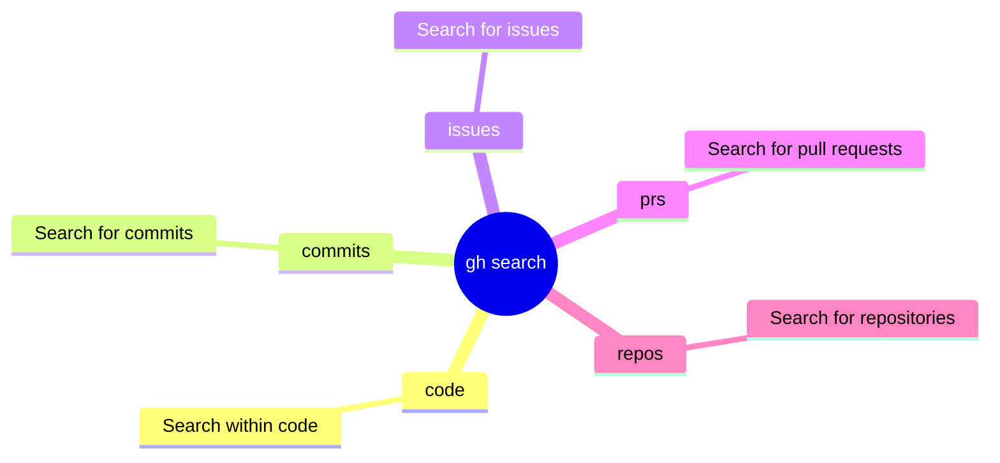

<!-- markdownlint-disable MD013 MD023 MD031 MD032 -->
# gh-search Skill

Use `gh search` to query GitHub for code, commits, issues, pull requests, and repositories.
Prefer structured JSON output over manual text parsing.

## When to Use

- To find examples of specific function usage or API patterns across millions of repositories.
- When looking for issues or PRs that match specific criteria (labels, state, author) across an entire organization.
- To programmatically aggregate repository metadata using structured `--json` output.

## When Not to Use

- For searching file contents within a small, local repository (use `grep` or `rg` directly instead of incurring API latency).
- When attempting to perform automated code modifications or refactoring across multiple repos.
- If you just need to view a single known issue or PR by its number (use `gh issue view` or `gh pr view`).

## Common Pitfalls

- **Parsing Tabular Output**: Attempting to use `awk` or `grep` on the default visual output instead of utilizing `--json` and `--jq`, leading to brittle scripts.
- **Unbounded Searches**: Running a query without the `--limit` flag, pulling down an overwhelming number of results that exhaust the API rate limit or the agent's context window.
- **Indexing Delays**: Searching for code that was committed only minutes ago and assuming it doesn't exist when GitHub's search index hasn't caught up yet.

## Commands / Usage Patterns

- **Search Repositories**:
  `gh search repos "query" --limit 10 --json nameWithOwner,description,url`
  Example output:
  `[{"description":"RAG Framework...","nameWithOwner":"truefoundry/cognita","url":"..."}]`

- **Search Pull Requests**:
  `gh search prs --state=open --limit 10 --json number,title,repository`
  Example output:
  `[{"number":123,"repository":{"name":"repo"},"title":"Fix issue"}]`

- **Search Issues**:
  `gh search issues --state=open --label="bug" --limit 10 --json number,title,url`
  Example output:
  `[{"number":456,"title":"Bug description","url":"..."}]`

- **Search Code**:
  `gh search code "functionName" --extension="js" --json path,url`
  Example output:
  `[{"path":"src/index.js","url":"https://github.com/.../src/index.js"}]`

- **Search Commits**:
  `gh search commits "fix regex" --limit 10 --json sha,message,author`
  Example output:
  `[{"author":{"login":"user"},"message":"fix regex","sha":"abcdef"}]`

- **Search for dotfiles repositories**:
  `gh search repos "dotfiles" --limit 20`

## Mindmap of Commands

## Core Principles

- Use `--json` to request specific fields and output in structured JSON format. This avoids fragile parsing of tabular shell output.
- Always use `--limit` to bound the results, especially when searching across all of GitHub. Default limit is often 30, but explicit bounds ensure efficiency.
- When searching within a specific repository, use the `--repo="owner/repo"` flag to narrow the search scope.
- For complex data extraction, combine `--json` with `--jq` to filter results on the client side.

## Diagnostics and Troubleshooting

- If a search returns no results, try broadening the query or removing filters like `--extension` or `--label` to isolate the problem.
- Remember that code search has indexing delays; very recent changes might not appear immediately.

## What to Avoid

- Do not use `grep` or `awk` to parse the default tabular output of `gh search`. Always use `--json`.
- Avoid unbounded searches (without `--limit`) if you only need a few examples or the latest item.
