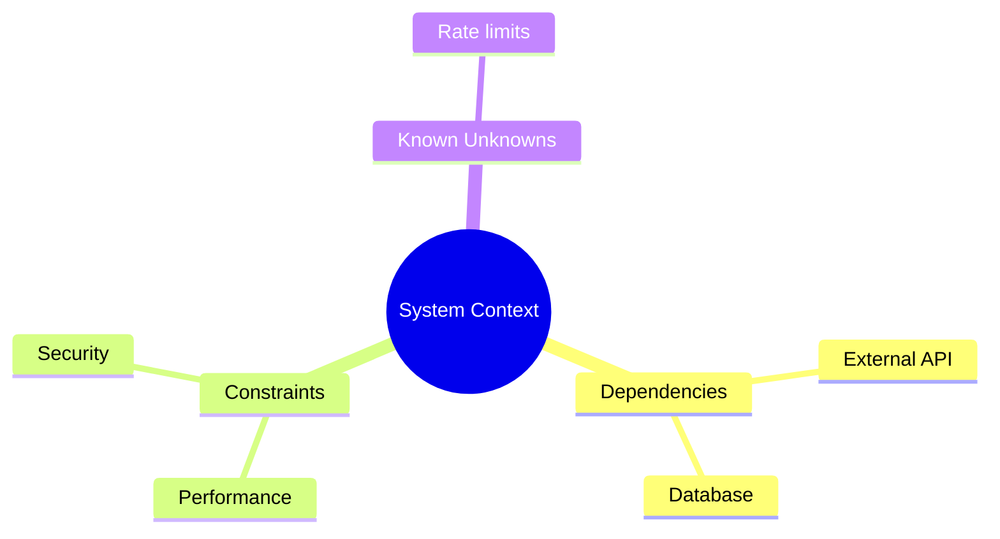
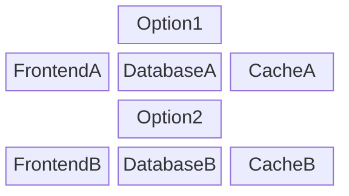
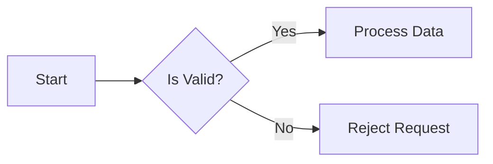
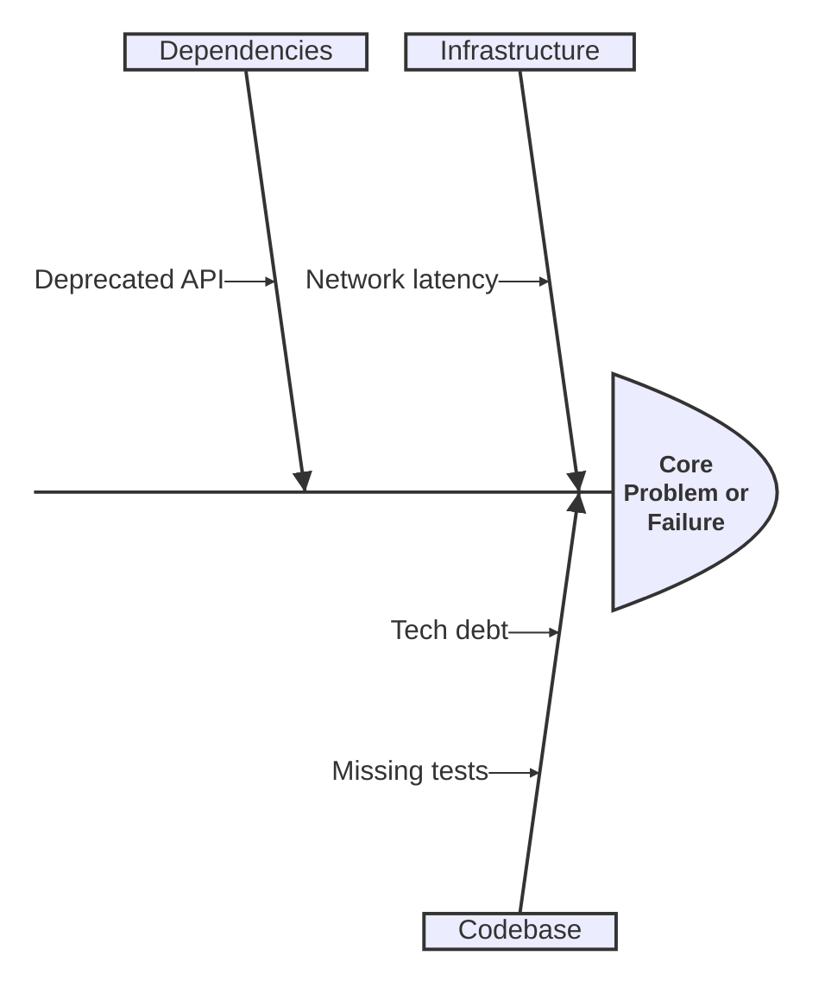
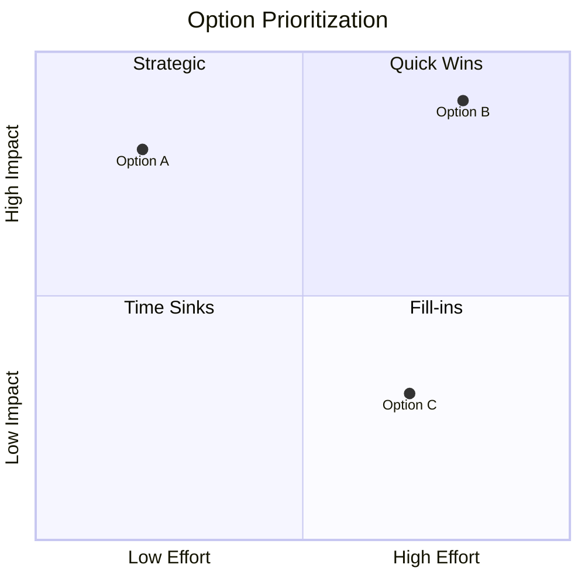
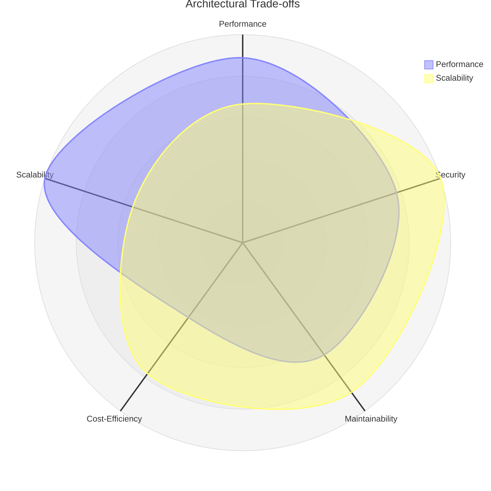

# Skill brainstorm

<!-- markdownlint-disable MD013 MD023 MD031 MD032 -->

A cognitive framework and protocol for exploring options, breaking down complexities, and summarizing information.

## WHEN TO USE

- Brainstorming alternative solutions for systemic issues or technical debt.
- Breaking down highly complex features into manageable, atomic components.
- Deconstructing an ambiguous problem space to define clear facts and priorities.
- Exploring and comparing multiple architectural options before committing to a design.
- Visualizing system dependencies and constraints to establish a shared mental model.

## WHEN NOT TO USE

- Convergent evaluation of a single plan (use `critical-thinking` instead).
- Narrow technical debugging (use `critical-thinking` or `tester` instead).
- Simple file management or git operations.

## Core Process

1. **Context Gathering & Research**: Aggressively gather facts, existing data, and constraints before formulating any conclusions.
2. **Explore Options**: Generate multiple orthogonal approaches or alternative options. Do not settle for the first apparent solution.
3. **Deconstruct Complexities**: Break down the problem space into atomic, manageable components.
4. **Visual Summarization**: Synthesize the gathered data and complexities into simple, easy-to-read Mermaid diagrams (e.g., mindmaps, block diagrams, or flowcharts).

## Core Principles

- **Design-It-Twice Protocol**: ALWAYS generate at least two distinct architectural paths before recommending a preferred solution.
- **Divergent Before Convergent**: Ensure a broad exploration of the problem space (divergent thinking) before narrowing down to specific recommendations (convergent thinking).
- **Fact-Based Exploration**: Anchor all generated options in empirical data retrieved from the codebase, project memory, or provided context.
- **Recursive Decomposition**: Break every complex objective into its atomic components to manage cognitive load and ensure precision.
- **Visual Clarity First**: Use diagrams early to establish a shared mental model before diving into deep technical or textual analysis.

## Diagnostics and Usage Patterns

- **Component Architecture Visualization**: Map high-level structural components with a Mermaid `block-beta` diagram.
- **Context & Ecosystem Mapping**: Map out the current ecosystem, constraints, and known unknowns using a Mermaid `mindmap` before defining architectural changes.
- **Diagramming Focus**:
  Default to high-level topological or structural diagrams (`block-beta`, `flowchart`, `mindmap`, `quadrantChart`, `radar-beta`) to visualize options and establish facts.
- **Flow & Logic Breakdown**: Detail sequential states and dependencies using a Mermaid `flowchart`.
- **Root Cause & Priority Mapping**: Use `ishikawa-beta`, `quadrantChart`, or `radar-beta` for evaluating alternatives, prioritization, and deep-dive problem exploration.

## Brainstorming - Problem Breakdown

When you need to explore a complex problem, use this step-by-step visual approach to ensure all facts are gathered and complexity is reduced:

### Step 1: Context & Ecosystem Mapping

Before proposing any changes, gather all relevant facts and constraints. Map the existing environment using a `mindmap`.

### Step 2: Component Architecture Visualization

Break the problem into structural parts and orthogonal options using a `block-beta` diagram so the options can be compared effectively.

### Step 3: Flow & State Modeling

Finally, visualize the behavior, state changes, or sequential logic required for the proposed options using a `flowchart`.

### Step 4: Root Cause Exploration (If Applicable)

When brainstorming around a systemic issue or failure, use an `ishikawa-beta` (fishbone) diagram to aggressively deconstruct contributing factors before jumping to conclusions.

### Step 5: Prioritization Mapping

When multiple paths, options, or tasks are generated, map them onto a `quadrantChart` to evaluate trade-offs like effort versus impact.

### Step 6: Trade-off Analysis

For complex architectural decisions, use a `radar-beta` diagram to score options across multiple competing dimensions.

## What to Avoid

- **Assumption-Driven Brainstorming**: Relying on guesses instead of factual context gathered through tools.
- **False Dichotomies**: Assuming only two opposing solutions exist without exploring orthogonal architectural paths.
- **Overcomplicated Diagrams**: Creating massive, unreadable diagrams. Break them into smaller, focused visual summaries.
- **Premature Convergence**: Proposing a final solution without explicitly documenting the discarded alternative options.

## Related Skills

- **brainstorm-agent-runs**: You MUST load this skill when identifying agentic runs in CI/CD for a Pull Request.
- **brainstorm-github-pr**: You MUST load this skill when asked to analyze or brainstorm a Pull Request.
- **critical-thinking**: You MUST load this skill when evaluating the options generated during brainstorming.
- **mermaid**: You MUST load this skill when constructing standard Mermaid diagrams.
- **mermaid-beta**: You MUST load this skill when using experimental Mermaid diagrams.
- **minizinc**: You MUST load this skill when executing or deeply modeling constraint satisfaction problems.
