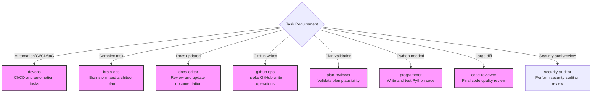

# subagent-task

<!-- markdownlint-disable MD013 MD023 MD031 MD032 -->

Provides policies and examples for using the `task` tool to spawn sub-agents for specialized, parallel, or complex tasks.

## WHEN TO USE

- Delegating complex, multi-step tasks to specialized project agents.
- Executing modular sub-tasks in parallel (e.g., retrieving facts, analyzing logs, validating plans).
- Preventing context clutter in the primary agent by offloading heavy reading or analysis to a sub-agent.
- Utilizing specific personas for targeted expertise.

## WHEN NOT TO USE

- For trivial, single-step operations (e.g., running a quick `ls` or a simple `git commit`).
- When the overhead of explaining the task to a sub-agent outweighs doing it directly.
- If the primary agent is already a specialized agent perfectly suited for the entire task.

## Core Principles

- **Specialization**: Delegate tasks to specialized project agents rather than attempting to handle broad contexts monolithically.
- **Parallelization**: Spawn multiple agents concurrently for independent sub-tasks (e.g., retrieving facts, analyzing logs, validating plans).
- **Context Encapsulation**: Spawning sub-agents prevents the primary agent's context from becoming cluttered. Synthesize results from sub-agents into the final response.

## SUBAGENT DELEGATION POLICY

The use of the `task` tool and spawning sub-agents is permitted for complex, multi-step tasks, but delegation is limited to the project agents explicitly configured by this runtime.

- **Allowed Delegation Targets**: Use only the named project agents exposed by this runtime configuration.
- **Built-in Subagents Disabled**: Built-in `explore` and `general` subagents are not approved for this runtime and MUST NOT be used, even if a host tool still lists them.
- **Maintain Context**: Ensure that the primary agent remains the coordinator and synthesizes the results from sub-agents into the final response.
- **Strategic Delegation**: Delegate only when the task involves broad codebase analysis or independent sub-tasks that can be executed in parallel.

## Common Pitfalls

- **Vague Delegation Prompts**: Sending ambiguous instructions to the sub-agent ("fix the code") without explicit context or success criteria, resulting in poor outcomes.
- **Ignoring Sub-Agent Output**: Failing to properly read and synthesize the results returned by the `task` tool before taking further action.
- **Spawning the Wrong Agent Type**: Delegating a task to an inappropriate agent (e.g., using `programmer` for DevOps automation instead of `devops`), leading to failed runs.

## Example: Agent Delegation Protocol

```mermaid
flowchart TD
    %% --------------------------------------------------------
    %% Agent Delegation Protocol
    %% --------------------------------------------------------
    subgraph Flow_Agent_Delegation ["Agent Delegation Protocol"]
        direction TB
        Arch((Cogni AI Architect))
        Arch -->|task tool| DevOps[cogni-ai-devops<br/>Task automation, CI/CD, IaC]
        Arch -->|task tool| FactOps[cogni-ai-fact-ops<br/>Maintain facts & info consistency]
        Arch -->|task tool| Coder[cogni-ai-coder<br/>Spec-driven code implementation]
        Arch -->|task tool| Programmer[cogni-ai-programmer<br/>Algorithmic problem-solving]
        Arch -->|task tool| Developer[cogni-ai-developer<br/>Full-cycle product delivery]
        Arch -->|task tool| BrainOps[cogni-ai-brain-ops<br/>Gather facts, constraints, plan]
        Arch -->|task tool| GHOps[cogni-ai-github-ops<br/>Modify comments, issues, discussions]
        Arch -->|task tool| CodeRev[cogni-ai-code-reviewer<br/>PR analysis, quality, security]
        Arch -->|task tool| SecAud[cogni-ai-security-auditor<br/>Security audit & PR review]
        Arch -->|task tool| PlanRev[cogni-ai-plan-reviewer<br/>Architectural & plan validation]
        Arch -->|task tool| Tester[cogni-ai-tester<br/>Execute tests, verify behavior]
        Arch -->|task tool| C7Ops[cogni-ai-context7-ops<br/>Retrieve & filter documentation]
    end
```

## Example: Delegation Scenarios

## Usage Patterns

- Always pass a clear `description` and a detailed `prompt` to the sub-agent.
- Provide the `subagent_type` argument to match the desired role. Ensure you check your available tools dynamically to find the currently supported list of project-specific agents rather than relying on a hardcoded list, as this functionality exists and is strongly recommended to be utilized for more specialized agents for relevant context.
- Ensure the primary agent acts as a coordinator, processing the `task_result` from each sub-agent before continuing the plan.
- If a sub-agent misbehaves (e.g., returning an unexpected reply) or fails to meet expectations, report this issue to the user with a clear explanation.

## What to Avoid

- **Do NOT use `subagent_type` for skills**:
  The `subagent_type` parameter is reserved for agent types. Skills are loaded inside the sub-agent via the `skill` tool.

## Related Skills

- **critical-thinking**:
  You MUST load this skill when deconstructing complex tasks for sub-agent delegation.
- **gh**:
  You MUST load this skill when working with the `gh` command and its subcommands.
